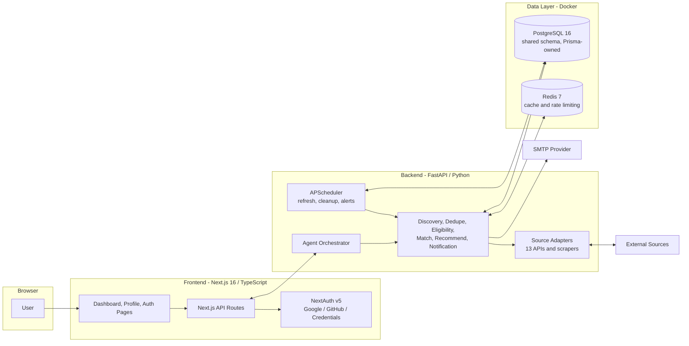

# Hire Alert

**Live deployed link:** https://hire-alert.vercel.app/

An AI-driven job and opportunity discovery platform that aggregates listings from multiple public sources, evaluates each opportunity against a user's professional profile, and delivers a curated, deadline-prioritized board with in-app and email alerts.

Hire Alert covers full-time roles, internships, hackathons, competitions, scholarships, and freelance engagements. Every opportunity receives a computed fit score (0-100) and is classified into a deadline-based priority tier. Only opportunities meeting a strict 75% eligibility threshold are surfaced to the user.

---

## Table of Contents

- [Key Features](#key-features)
- [Architecture](#architecture)
- [Agent Pipeline](#agent-pipeline)
- [Data Sources](#data-sources)
- [Technology Stack](#technology-stack)
- [Getting Started](#getting-started)
- [Configuration](#configuration)
- [Matching and Priority Logic](#matching-and-priority-logic)
- [Project Structure](#project-structure)
- [Known Limitations](#known-limitations)

---

## Key Features

- **Multi-source aggregation** — 13 data sources (public APIs and scrapers) unified into a single opportunity model.
- **AI agent pipeline** — a 10-agent orchestration handles discovery, deduplication, eligibility evaluation, fit scoring, recommendation, and notification.
- **Profile-based matching** — heuristic fit scoring across skills, role alignment, education, location, experience, and domain interest. No external LLM calls; the pipeline is fast, deterministic, and cost-free.
- **Deadline-aware prioritization** — opportunities are bucketed into HIGH, MEDIUM, and LOW priority tiers based on time remaining.
- **Email and in-app alerts** — users are notified the moment an opportunity enters the HIGH priority tier. A background scheduler re-evaluates deadlines every two hours.
- **Application tracking** — apply, reject, and un-reject workflows with dedicated dashboard views per state.
- **Comprehensive user profile** — six profile sections (basic information, job preferences, education, experience, technical skills, resume and portfolio) drive the matching engine.
- **Authentication** — Google OAuth, GitHub OAuth, and credential-based sign-in via NextAuth.

---

## Architecture



Both the frontend (via Prisma) and the backend agents (via SQLAlchemy models) read and write the same PostgreSQL database. The Prisma schema is the single source of truth for the data model.

---

## Agent Pipeline

Triggered on demand from the dashboard ("Scan Jobs") or by the background scheduler:

```
Job Discovery -> Database Update -> Duplicate Removal -> Eligibility
    -> AI Matching (fit score) -> Recommendation (threshold >= 75%) -> Notification
```

| Agent | Responsibility |
|---|---|
| JobDiscoveryAgent, InternshipAgent, HackathonEventAgent, ScholarshipAgent, FreelancingAgent | Fetch and normalize opportunities by category |
| DatabaseUpdateAgent | Persist new opportunities to PostgreSQL |
| DuplicateRemovalAgent | Deduplicate across overlapping sources |
| EligibilityAgent | Filter against profile constraints (location, work authorization, education) |
| AIMatchingAgent | Compute the 0-100 fit score |
| RecommendationAgent | Retain only opportunities at or above the 75% threshold |
| NotificationAgent | Emit in-app alerts and priority-based email notifications |

---

## Data Sources

| Source | Category | Access Method |
|---|---|---|
| LinkedIn (guest search API) | Jobs, Internships | Public HTML API, no authentication required |
| Remotive | Remote jobs | Public API |
| Jobicy | Remote jobs | Public API |
| Arbeitnow | Technology jobs | Public API |
| Devpost | Hackathons | Public API |
| MLH | Hackathons | Public HTML (schema.org markup) |
| Unstop | Hackathons, Scholarships | Public API |
| Kaggle | Competitions | Authenticated API or HTML fallback |
| GitHub | Open-source opportunities | Public API |
| Internshala | Internships | Best-effort scraping |
| Wellfound | Startup jobs | Best-effort (authentication required) |
| Naukri | Jobs | Best-effort (frequently blocked; graceful skip) |
| Reddit | Freelance, Jobs | Best-effort (frequently blocked; graceful skip) |

---

## Technology Stack

| Layer | Technology |
|---|---|
| Frontend | Next.js 16, React 19, TypeScript, Tailwind CSS 4, shadcn/ui, NextAuth v5 |
| Backend | FastAPI, Uvicorn, SQLAlchemy 2, APScheduler |
| Database | PostgreSQL 16 (Prisma ORM as schema owner), Redis 7 (caching) |
| Infrastructure | Docker Compose |
| Scraping | httpx, BeautifulSoup4, lxml, tenacity (retries) |

---

## Getting Started

### Prerequisites

- Docker Desktop
- Node.js 18 or later
- Python 3.11 or later
- Windows PowerShell (for the provided start scripts)

### Quick Start

```powershell
# Start infrastructure (PostgreSQL, Redis) and both applications
.\scripts\start-dev.ps1
```

### Manual Setup

```powershell
# 1. Start database services
docker compose up -d postgres redis

# 2. Frontend
cd frontend
npm install
npx prisma db push
npx prisma generate
npm run dev                 # http://localhost:3000

# 3. Backend (separate terminal)
cd ..\backend
python -m venv .venv
.\.venv\Scripts\Activate.ps1
pip install -r requirements.txt
python -m uvicorn app.main:app --port 8000   # http://localhost:8000/docs
```

### First-Run Flow

1. Open http://localhost:3000 and register, or sign in with Google or GitHub.
2. Complete the profile: skills, preferred roles, education, and interests.
3. From the dashboard, select **Scan Jobs** to run the agent pipeline.
4. Review the curated board with priority tiers and fit scores. Apply, reject, or un-reject as needed.

---

## Configuration

Environment variables are configured in `.env` at the repository root (see `.env.example`) and in `backend/.env` for backend-specific settings.

**Frontend (root `.env`):**

| Variable | Purpose |
|---|---|
| `DATABASE_URL` | PostgreSQL connection string (port 5433 by default) |
| `AUTH_SECRET` / `AUTH_URL` | NextAuth session secret and base URL |
| `AUTH_GOOGLE_ID` / `AUTH_GOOGLE_SECRET` | Google OAuth (optional) |
| `AUTH_GITHUB_ID` / `AUTH_GITHUB_SECRET` | GitHub OAuth (optional) |
| `NEXT_PUBLIC_BACKEND_URL` | Base URL of the FastAPI backend |
| `BACKEND_API_KEY` | Shared key authenticating frontend-to-backend calls |

**Backend (`backend/.env`):**

| Variable | Purpose |
|---|---|
| `DATABASE_URL` / `REDIS_URL` | Data-layer connection strings |
| `BACKEND_API_KEY` | Must match the frontend value |
| `KAGGLE_USERNAME` / `KAGGLE_KEY` | Unlocks the official Kaggle API (optional) |
| `EMAIL_ENABLED` | Enables SMTP notifications |
| `SMTP_HOST` / `SMTP_PORT` / `SMTP_USER` / `SMTP_PASSWORD` | SMTP credentials |
| `EMAIL_FROM` | Sender address for alert emails |
| `HIGH_PRIORITY_DAYS` / `MEDIUM_PRIORITY_DAYS` | Priority tier boundaries (7 / 15) |
| `DEFAULT_DEADLINE_DAYS` | Assumed deadline when a source provides none (30) |
| `REFRESH_INTERVAL_HOURS` | Scheduler refresh cadence (24) |

Example SMTP configuration (Gmail):

```env
EMAIL_ENABLED=true
SMTP_HOST=smtp.gmail.com
SMTP_PORT=587
SMTP_USER=you@gmail.com
SMTP_PASSWORD=<app password>
EMAIL_FROM=Hire Alert <you@gmail.com>
```

When SMTP is disabled, alerts remain available in-app.

---

## Matching and Priority Logic

**Fit score (0-100):**

| Component | Weight |
|---|---|
| Skills | 40 |
| Role alignment | 25 |
| Education | 15 |
| Location | 10 |
| Experience | 10 |
| Domain interest | 5 |

Skills are aggregated across all profile categories (languages, frameworks, databases, cloud, AI/ML, and more). Weights and thresholds are configurable.

**Eligibility rule:** only opportunities with a fit score of 75 or above are displayed, in both the "For You" board and search results. Sub-threshold opportunities are treated as ineligible and hidden.

**Priority tiers:**

| Tier | Condition |
|---|---|
| HIGH | Deadline within 7 days |
| MEDIUM | Deadline in 7-15 days |
| LOW | Deadline beyond 15 days |

Sources without an explicit deadline default to a 30-day window (`DEFAULT_DEADLINE_DAYS`).

**Search filters:** keyword, opportunity type, location, work mode (Remote / Hybrid / On-site), priority tier, experience level, and minimum match percentage (75 / 80 / 90).

---

## Project Structure

```
backend/
  app/
    agents/       # Agent pipeline: orchestrator plus 10 specialized agents
    sources/      # Per-source adapters (API clients and scrapers)
    api/          # FastAPI routes (/api/agents, /api/opportunities)
    core/         # Configuration and rate limiting
    models/       # SQLAlchemy models mirroring the Prisma schema
    services/     # Redis caching layer
    workers/      # APScheduler: daily refresh, cleanup, priority alerts
frontend/
  src/
    app/          # Next.js App Router: dashboard, profile, auth, API routes
    components/   # Dashboard, layout, and UI components
    lib/          # Database client, auth, API client, shared types
  prisma/         # Schema definition (source of truth for the data model)
scripts/          # PowerShell start scripts for development and production
docker-compose.yml
```

---

## Known Limitations

- Naukri and Reddit frequently block automated access (CAPTCHA, HTTP 403). The pipeline degrades gracefully; remaining sources keep the board current.
- Fit scoring is heuristic rather than LLM-based. This trades semantic nuance for speed, determinism, and zero inference cost.
- Wellfound requires authentication and is therefore best-effort.
- Kaggle scraping without API credentials may be rate-limited; adding `KAGGLE_USERNAME` and `KAGGLE_KEY` is recommended.
